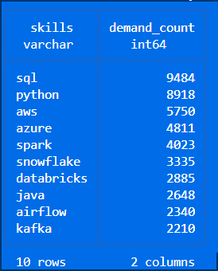
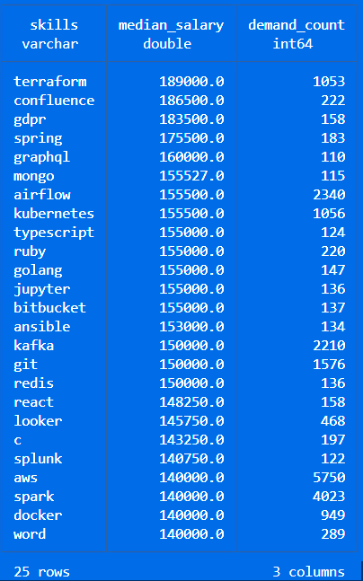
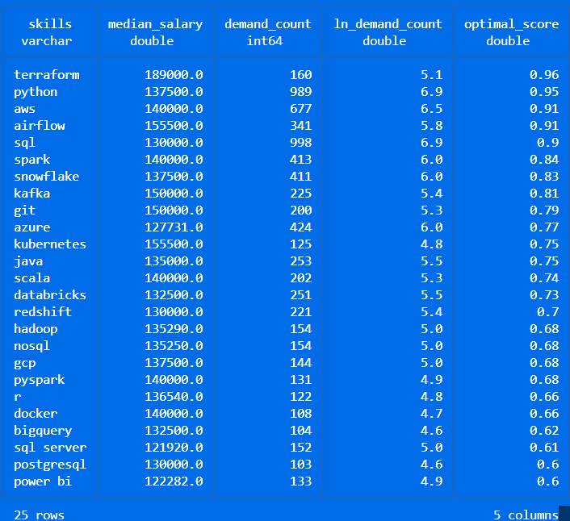

# Exploratory Data Analysis w/ SQL: Job Market Analytics

A SQL project analyzing the data engineer job market using real world job posting data. It demonstrates my ability to **write production-quality analytical SQL, design efficient queries, and turn business questions into data-driven insights.**

## Executive Summary  

 - ✅ Project scope: Built 3 analytical queries that answer key questions about the data engineer U.S job market  
 - ✅ Data modeling: Used multi-table joins across fact and dimension tables to extract insights  
 - ✅ Analytics: Applied aggregations, filtering, and sorting to find top skills by demand, salary, and overall value  
 - ✅ Outcomes: Delivered actionable insights on SQL/Python dominance, cloud trends, and salary patterns  

If you only have a minute, review these:  

1. [`01_top_demanded_skills.sql`](./01_top_demanded_skills.sql) - demand analysis with multi-table joins

2. [`02_highest_paying_skills.sql`](./02_highest_paying_skills.sql) - salary analysis with aggregations

3. [`03_most_optimal_skills.sql`](./03_most_optimal_skills.sql) - combined demand/salary optimization query

## Problem & Context  

Job market analysts need to answer questions like:  

 - 🎯 Most in-demand: Which skills are most in-demand for data engineers?  
 - 💰 Highest paid: Which skills command the highest salaries?  
 - ⚖️ Best trade-off: What is the optimal skill set balancing demand and compensation?  

This project analyzes a data warehouse built using a star schema design. The warehouse structure consists of:  

 

 - **Fact Table:**  `job_postings_fact` - Central table containing job posting details (job titles, locations, salaries, dates, etc.)  
 - **Dimension Tables:**  
    - `company_dim` - Company information linked to job postings  
    - `skills_dim` - Skills catalog with skill names and types  
 - **Bridge Table:** `skills_job_dim` - Resolves the many-to-many relationship between job postings and skills  

By querying across these interconnected tables, I extracted insights about skill demand, salary patterns, and optimal skill combinations for data engineering roles.

## Tech Stack  

 - 🐤 **Query Engine:**  DuckDB for fast OLAP-style analytical queries  
 - 🧮 **Language:**  SQL (ANSI-style with analytical functions)  
 - 📊 **Data Model:**  Star schema with fact + dimension + bridge tables  
 - 🛠️ **Development:**  VS Code for SQL editing + Terminal for DuckDB CLI
 - 📦 **Version Control:**  Git/GitHub for versioned SQL scripts

## Analysis Overview

**Query Structure**  
1. **[Top Demanded Skills](01_top_demanded_skills.sql)** – Identifies the 10 most in-demand skills for remote data engineer positions
2. **[Higest Paying Skills](./02_highest_paying_skills.sql)** – Analyzes the 25 highest-paying skills with salary and demand metrics
3. **[Most Optimal Skills](./03_most_optimal_skills.sql)** – Calculates an optimal score using natural log of demand combined with median salary to identify the most valuable skills to learn  

**Key Insights**
 - 🧠 Core languages: SQL appears in ~9,484 postings while Python appears in ~8,918 job postings, making them the most demanded skills
 - ☁️ Cloud platforms: AWS and Azure are critical for modern data engineering roles
 - 🧱 Infrastructure & tooling: Terraform and Kubernetes are associated with premium salaries
 - 🔥 Big data tools: Apache Spark shows strong demand with competitive compensation

## Key Findings

**Top Demanded Skills** 
 - SQL and Python are the two most demanded skills in remote U.S. data engineer postings.
 - AWS and Azure show that cloud platform knowledge is a core requirement.
 - Spark, Snowflake, and Databricks reinforce demand for modern data processing and analytics platforms.
 - Airflow and Kafka suggest that orchestration and streaming are important supporting skills.  

   
 
**Top Paying Skills** 
 - Terraform is the top-paying skill in the analysis, showing that infrastructure-as-code knowledge is highly valued.  
 - Airflow and Kubernetes combine strong salaries with solid demand, making them especially relevant for modern data engineering roles.
 - Kafka also stands out, reinforcing the value of streaming and distributed systems experience.
 - Several of the highest-paying skills are more specialized tools rather than the most common everyday skills.
 - The salary leaders suggest that employers pay a premium for engineers who can support infrastructure, orchestration, and production-ready systems.

 

**Most Optimal Skills** 
 - Python and SQL rank near the top because they balance strong demand with solid compensation.
 - AWS, Airflow, and Spark also perform well, making them practical high-value skills for data engineers.
 - Terraform ranks highly again because its salary strength outweighs its lower demand relative to core languages.
 - The optimal skills list highlights tools that are both marketable and realistic to learn for long-term career growth.
 - This section shows that the best career choices are not always the highest-paying niche tools, but the skills that combine relevance and opportunity.

 

## SQL Skills Demonstrated  

**Query Design & Optimization**  
 - **Complex Joins:** Multi-table `INNER JOIN` operations across `job_postings_fact`, `skills_job_dim`, and `skills_dim`
 - **Aggregations:** `COUNT()`, `MEDIAN()`, `ROUND()` for statistical analysis
 - **Filtering:** Boolean logic with WHERE clauses and multiple conditions (`job_title_short`, `job_work_from_home`, `job_country`, `salary_year_avg IS NOT NULL`)
 - **Sorting & Limiting:** `ORDER BY` with `DESC` and `LIMIT` for top-N analysis  

## Data Analysis Techniques
 - **Grouping:** `GROUP BY` for categorical analysis by skill  
 - **Mathematical Functions:** `LN()` for natural logarithm transformation to normalize demand metrics  
 - **Calculated Metrics:**  Derived optimal score combining log-transformed demand with median salary  
 - **HAVING Clause:**  Filtering aggregated results (skills with >= 100 postings)  
 - **NULL Handling:**  Proper filtering of incomplete records (`salary_year_avg IS NOT NULL`)

